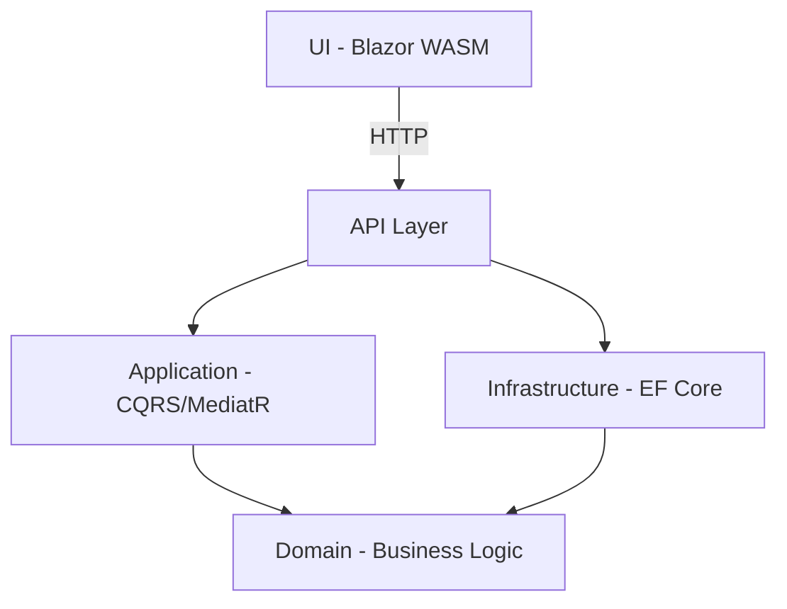

# GoodHamburger

A production-ready hamburger ordering system built with **.NET 10**, following **Simplified Clean Architecture**, featuring a RESTful API and Blazor WebAssembly frontend.

---

## Overview

GoodHamburger is a focused ordering system for a hamburger restaurant. It allows customers to create orders with sandwiches, sides, and drinks while automatically applying discount rules. The system enforces business rules like maximum item limits and duplicate detection.

### Menu

| Category | Item | Price |
| :--- | :--- | :--- |
| **Sandwich** | X Burger | $5.00 |
| **Sandwich** | X Egg | $4.50 |
| **Sandwich** | X Bacon | $7.00 |
| **Side** | Fries | $2.00 |
| **Drink** | Soda | $2.50 |

### Business Rules

* **Maximum per order:** 1 Sandwich, 1 Side, 1 Drink.
* **No duplicate items** allowed.
* **Automatic discounts:**
  * Sandwich + Side + Drink → **20% off**
  * Sandwich + Drink → **15% off**
  * Sandwich + Side → **10% off**
  * Otherwise → **0% off**

---

## Architecture

### Why Simplified Clean Architecture?

Traditional Clean Architecture introduces significant complexity with patterns like Repositories, Specifications, Domain Events, Value Objects, and AutoMapper. For a focused domain, these patterns often add maintenance overhead without proportional benefits.

**Our approach keeps the essence of Clean Architecture:**

* **Dependency Inversion:** Domain has zero dependencies.
* **Separation of Concerns:** Each layer has a single responsibility.
* **Testability:** Domain logic is fully testable in isolation.

**While removing unnecessary "ceremony":**

* **No AutoMapper:** Manual mapping is clearer and easier to debug.
* **No Value Objects:** Primitives are sufficient for this scope.
* **No Result pattern:** Standard exceptions are used for business rule violations.

### Layer Dependency Flow



### Project Structure

```text
GoodHamburger.sln
├── src/
│   ├── GoodHamburger.Domain/         # Pure entities & rules
│   ├── GoodHamburger.Application/    # CQRS Handlers, DTOs
│   ├── GoodHamburger.Infrastructure/ # EF Core, Repositories
│   └── GoodHamburger.API/            # Controllers, Middleware
├── UI/
│   └── GoodHamburger.Blazor/         # Blazor WebAssembly
└── tests/
    └── GoodHamburger.Tests/          # Unit & Integration Tests
```

### Technology Stack

| Component | Technology |
| :--- | :--- |
| **Runtime** | .NET 10.0 |
| **API Framework** | ASP.NET Core Web API |
| **Database** | SQLite (EF Core) |
| **CQRS** | MediatR 12 |
| **Frontend** | Blazor WebAssembly |
| **Testing** | xUnit |

---

## Getting Started

### Prerequisites

* [.NET 10.0 SDK](https://dotnet.microsoft.com/download/dotnet/10.0)
* Any modern browser

### Running the Application

1. **Clone and Enter:**

    ```bash
    git clone <repository-url>
    cd GoodHamburger
    ```

2. **Start the API:**

    ```bash
    cd src/GoodHamburger.API
    dotnet run
    ```

    *API starts at `https://localhost:7001`*

3. **Start the UI:** (New terminal)

    ```bash
    cd UI/GoodHamburger.Blazor
    dotnet run
    ```

    *UI starts at `https://localhost:5001`*

---

## API Usage

### Endpoints

| Method | Endpoint | Description |
| :--- | :--- | :--- |
| **GET** | `/api/menu` | Get full menu |
| **GET** | `/api/orders` | Get all orders |
| **POST** | `/api/orders` | Create new order |

**Example Request:** `POST /api/orders`

```json
{
    "menuItemIds": [1, 4, 5]
}
```

**Example Response:**

```json
{
    "id": 1,
    "items": [...],
    "subtotal": 9.50,
    "discount": 1.90,
    "total": 7.60,
    "createdAt": "2026-04-28T12:00:00Z"
}
```

---

## Trade-Offs & Decisions

* **Manual Mapping:** We chose explicit mapping over AutoMapper to ensure compile-time safety and avoid "magic" behavior that is hard to trace during debugging.
* **Exceptions for Business Rules:** We use `InvalidOperationException` for domain violations. A global middleware catches these to return `400 Bad Request`, keeping the Application Layer clean.
* **SQLite:** Chosen for zero-configuration setup. The Repository Pattern makes it trivial to swap to PostgreSQL for production.

---

## Production Readiness Checklist

### ✅ Completed

[x] Full CRUD & CQRS pattern
[x] Automated discount calculation engine
[x] Global exception handling middleware
[x] Decoupled UI (communicates only via HTTP)
[x] Comprehensive Test Suite (Unit + Integration)

### 🔄 Future Roadmap

[ ] **Database Migrations:** Move from `EnsureCreated` to proper script-based migrations.
[ ] **Auth:** Implement Identity with JWT.
[ ] **Resilience:** Add Polly for HTTP retries in the Blazor client.
[ ] **Observability:** Structured logging with Serilog and OpenTelemetry.

---

## License

Demonstration project. **Built with .NET 10 | Simplified Clean Architecture.**
