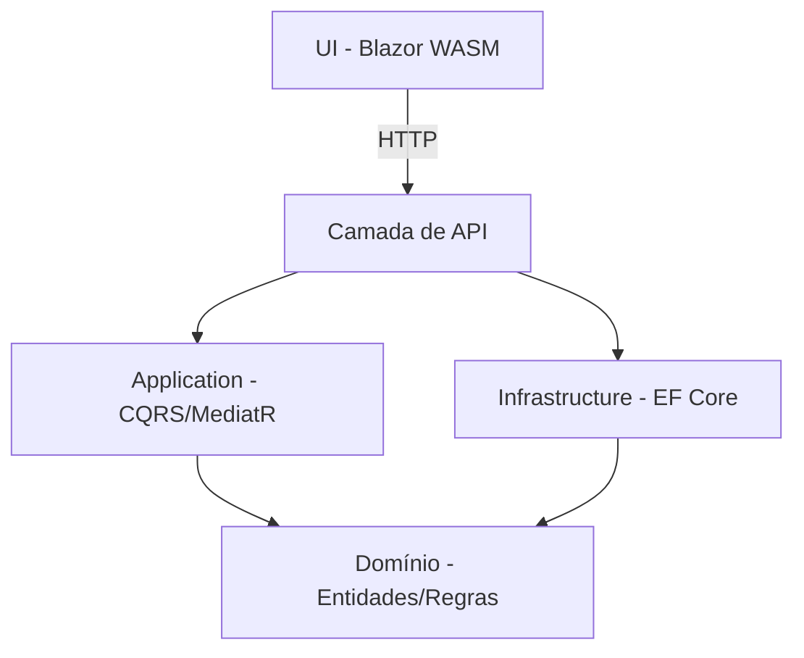

# GoodHamburger

Um sistema de pedidos de hambúrguer pronto para produção, construído com **.NET 10**, seguindo uma **Arquitetura Limpa Simplificada**, com API RESTful e frontend em Blazor WebAssembly.

---

## Visão Geral

GoodHamburger é um sistema de pedidos focado para uma hamburgueria. Ele permite que clientes criem pedidos com sanduíches, acompanhamentos e bebidas, aplicando automaticamente regras de desconto. O sistema garante regras de negócio como limites máximos de itens e detecção de duplicidade.

### Cardápio

| Categoria | Item | Preço |
| :--- | :--- | :--- |
| Sanduíche | X Burger | $5.00 |
| Sanduíche | X Egg | $4.50 |
| Sanduíche | X Bacon | $7.00 |
| Acompanhamento | Batata Frita | $2.00 |
| Bebida | Refrigerante | $2.50 |

### Regras de Negócio

* **Máximo por pedido:** 1 Sanduíche, 1 Acompanhamento, 1 Bebida.
* **Itens duplicados:** Não são permitidos.
* **Descontos automáticos:**
  * Sanduíche + Acompanhamento + Bebida → **20% de desconto**
  * Sanduíche + Bebida → **15% de desconto**
  * Sanduíche + Acompanhamento → **10% de desconto**
  * Caso contrário → **0% de desconto**

---

## Arquitetura

### Por que Arquitetura Limpa Simplificada?

A Arquitetura Limpa tradicional introduz complexidade significativa com padrões como Repositories, Specifications, Domain Events, Value Objects e AutoMapper. Para um domínio focado como gerenciamento de pedidos, esses padrões adicionam overhead de manutenção sem benefícios proporcionais.

**Nossa abordagem mantém a essência da Arquitetura Limpa:**

* **Inversão de Dependência:** o domínio não possui dependências.
* **Separação de Responsabilidades:** cada camada tem uma única responsabilidade.
* **Testabilidade:** a lógica de domínio é totalmente testável de forma isolada.
* **Independência:** a UI pode evoluir independentemente do backend.

**Removendo cerimônias desnecessárias:**

* **Sem AutoMapper:** mapeamento manual é mais claro e depurável.
* **Sem Value Objects:** tipos primitivos são suficientes neste domínio.
* **Sem Specification:** validações simples nos construtores.
* **Sem Domain Events:** chamadas diretas de método são suficientes.
* **Sem Result pattern:** exceções são apropriadas para violações de regras de negócio.
* **Sem Repositórios genéricos:** interfaces específicas evitam abstrações vazadas.

### Fluxo de Dependência das Camadas



### Estrutura do Projeto

```text
GoodHamburger.sln
├── src/
│   ├── GoodHamburger.Domain/        # Lógica de negócio pura
│   │   ├── Enums/
│   │   ├── Exceptions/
│   │   ├── Interfaces/
│   │   └── Models/
│   ├── GoodHamburger.Application/   # Handlers CQRS, DTOs
│   │   ├── DTOs/
│   │   ├── Mapping/
│   │   ├── Menu/
│   │   └── Orders/
│   ├── GoodHamburger.Infrastructure/ # EF Core, repositórios
│   │   ├── Data/
│   │   └── Repositories/
│   └── GoodHamburger.API/           # Controllers, middleware
│       └── Controllers/
├── UI/
│   └── GoodHamburger.Blazor/        # Blazor WebAssembly
│       ├── Models/
│       ├── Pages/
│       ├── Services/
│       └── Shared/
└── tests/
    └── GoodHamburger.Tests/
        ├── Domain/
        └── Integration/
```

### Stack Tecnológica

| Componente | Tecnologia |
| :--- | :--- |
| **Runtime** | .NET 10.0 |
| **API** | ASP.NET Core Web API |
| **Banco** | SQLite (EF Core) |
| **ORM** | Entity Framework Core |
| **CQRS** | MediatR 12 |
| **Frontend** | Blazor WebAssembly |
| **Testes** | xUnit |
| **CI/CD** | GitHub Actions |

---

## Começando

### Pré-requisitos

* [.NET 10.0 SDK](https://dotnet.microsoft.com/download/dotnet/10.0)
* Navegador moderno

### Executando a Aplicação

1. **Clonar o repositório**

    ```bash
    git clone <repository-url>
    cd GoodHamburger
    ```

2. **Executar a API**

    ```bash
    cd src/GoodHamburger.API
    dotnet run
    ```

    *A API inicia em `https://localhost:7001`*

3. **Executar a UI** (em outro terminal)

    ```bash
    cd UI/GoodHamburger.Blazor
    dotnet run
    ```

    *A UI inicia em `https://localhost:5001`*

### Endpoints da API

| Método | Endpoint | Descrição |
| :--- | :--- | :--- |
| **GET** | `/api/menu` | Retorna o cardápio |
| **GET** | `/api/orders` | Lista todos os pedidos |
| **GET** | `/api/orders/{id}` | Busca pedido por ID |
| **POST** | `/api/orders` | Cria novo pedido |
| **PUT** | `/api/orders/{id}` | Atualiza pedido |
| **DELETE** | `/api/orders/{id}` | Remove pedido |

**Exemplo de Criação de Pedido:**
`POST /api/orders`

```json
{
    "menuItemIds": [1, 4, 5]
}
```

*Cria um pedido com X Burger, Batata Frita e Refrigerante — aplicando 20% de desconto.*

---

## Perguntas Frequentes (Q&A)

**P: Por que usar a Clean Architecture Simplificada em vez da tradicional?**
**R:** A Clean Architecture tradicional muitas vezes introduz padrões que adicionam complexidade sem valor proporcional para domínios menores. Ao manter os princípios fundamentais e remover a "cerimônia", alcançamos os mesmos benefícios com menos código.

**P: Como funciona o cálculo de desconto?**
**R:** A lógica reside no método `RecalculateTotal()` da entidade `Order`. Ele verifica os tipos presentes e aplica a faixa de desconto. Isso garante que a regra de negócio seja aplicada no nível de domínio.

**P: Como você lida com a validação?**
**R:** A validação ocorre em dois níveis:

1. **Domínio:** Entidades lançam `InvalidOperationException` para violações de regras.
2. **API:** Um middleware global captura essas exceções e retorna o status HTTP adequado (400, 404, 500).

---

## Checklist de Produção

### ✅ Concluído

[x] CRUD completo e CQRS
[x] Regras de negócio e descontos automáticos
[x] UI desacoplada (Blazor WASM)
[x] Tratamento global de erros e logs iniciais
[x] Testes unitários e de integração

### 🔄 Para Produção (Roadmap)

[ ] Implementar Migrations reais
[ ] Autenticação e Autorização (JWT/Identity)
[ ] Versionamento de API
[ ] Dockerização (Dockerfile e Compose)
[ ] Monitoramento (OpenTelemetry + Health Checks)
[ ] Migração para PostgreSQL ou SQL Server

---

## Licença

Projeto para fins demonstrativos.
**Construído com .NET 10 | Arquitetura Limpa Simplificada | Blazor WebAssembly | EF Core**
